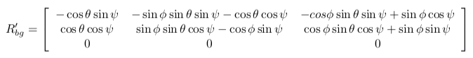

yo# Estimation Project #

Welcome to the estimation project.  In this project, we will be developing the estimation portion of the controller used in the CPP simulator.  By the end of the project, our simulated quad will be flying with our estimator and our custom controller (from the previous project)!

This README is broken down into the following sections:

 - [Setup](#setup) - the environment and code setup required to get started and a brief overview of the project structure
 - [The Tasks](#the-tasks) - the tasks we will need to complete for the project
 - [Tips and Tricks](#tips-and-tricks) - some additional tips and tricks we may find useful along the way
 - [Submission](#submission) - overview of the requirements for our project submission


## Setup ##

This project will continue to use the C++ development environment we set up in the Controls C++ project.

 1. Clone the repository
 ```
 git clone https://github.com/udacity/FCND-Estimation-CPP.git
 ```

 2. Import the code into our IDE like done in the [Controls C++ project](https://github.com/udacity/FCND-Controls-CPP#development-environment-setup)
 
 3. We should now be able to compile and run the estimation simulator just as we did in the controls project


### Project Structure ###

For this project, we will be interacting with a few more files than before.

 - The EKF is already partially implemented for we in `QuadEstimatorEKF.cpp`

 - Parameters for tuning the EKF are in the parameter file `QuadEstimatorEKF.txt`

 - When we turn on various sensors (the scenarios configure them, e.g. `Quad.Sensors += SimIMU, SimMag, SimGPS`), additional sensor plots will become available to see what the simulated sensors measure.

 - The EKF implementation exposes both the estimated state and a number of additional variables. In particular:

   - `Quad.Est.E.X` is the error in estimated X position from true value.  More generally, the variables in `<vehicle>.Est.E.*` are relative errors, though some are combined errors (e.g. MaxEuler).

   - `Quad.Est.S.X` is the estimated standard deviation of the X state (that is, the square root of the appropriate diagonal variable in the covariance matrix). More generally, the variables in `<vehicle>.Est.S.*` are standard deviations calculated from the estimator state covariance matrix.

   - `Quad.Est.D` contains miscellaneous additional debug variables useful in diagnosing the filter. We may or might not find these useful but they were helpful to us in verifying the filter and may give us some ideas if we hit a block.


#### `config` Directory ####

In the `config` directory, in addition to finding the configuration files for our controller and our estimator, we will also see configuration files for each of the simulations.  For this project, we will be working with simulations 06 through 11 and we may find it insightful to take a look at the configuration for the simulation.

As an example, if we look through the configuration file for scenario 07, we see the following parameters controlling the sensor:

```
# Sensors
Quad.Sensors = SimIMU
# use a perfect IMU
SimIMU.AccelStd = 0,0,0
SimIMU.GyroStd = 0,0,0
```

This configuration tells us that the simulator is only using an IMU and the sensor data will have no noise.  We will notice that for each simulator these parameters will change slightly as additional sensors are being used and the noise behavior of the sensors change.


## The Tasks ##

Once again, we will be building up our estimator in pieces.  At each step, there will be a set of success criteria that will be displayed both in the plots and in the terminal output to help us along the way.

Project outline:

 - [Step 1: Sensor Noise](#step-1-sensor-noise)
 - [Step 2: Attitude Estimation](#step-2-attitude-estimation)
 - [Step 3: Prediction Step](#step-3-prediction-step)
 - [Step 4: Magnetometer Update](#step-4-magnetometer-update)
 - [Step 5: Closed Loop + GPS Update](#step-5-closed-loop--gps-update)
 - [Step 6: Adding our Controller](#step-6-adding-our-controller)


## Step 1: Sensor Noise 


<p align="center">
  
</p>


 

For the controls project, the simulator was working with a perfect set of sensors, meaning none of the sensors had any noise.  The first step to adding additional realism to the problem, and developing an estimator, is adding noise to the quad's sensors.  For the first step, we will collect some simulated noisy sensor data and estimate the standard deviation of the quad's sensor.

1. Run the simulator in the same way as we have before

2. Choose scenario `06_NoisySensors`.  In this simulation, the interest is to record some sensor data on a static quad, so we will not see the quad move.  We will see two plots at the bottom, one for GPS X position and one for The accelerometer's x measurement.  The dashed lines are a visualization of a single standard deviation from 0 for each signal. The standard deviations are initially set to arbitrary values (after processing the data in the next step, we will be adjusting these values).  If they were set correctly, we should see ~68% of the measurement points fall into the +/- 1 sigma bound.  When we run this scenario, the graphs we see will be recorded to the following csv files with headers: `config/log/Graph1.txt` (GPS X data) and `config/log/Graph2.txt` (Accelerometer X data).

3. Process the logged files to figure out the standard deviation of the the GPS X signal and the IMU Accelerometer X signal.

4. Plug in our result into the top of `config/6_Sensornoise.txt`.  Specially, set the values for `MeasuredStdDev_GPSPosXY` and `MeasuredStdDev_AccelXY` to be the values we have calculated.

5. Run the simulator. If our values are correct, the dashed lines in the simulation will eventually turn green, indicating we’re capturing approx 68% of the respective measurements (which is what we expect within +/- 1 sigma bound for a Gaussian noise model)

An easy way to determine the standard deviation from the simulation generated logs Graph1.txt and Graph2.txt is by using the function  `std_GPS_ACC()` below:

```python

import numpy as np

def std_GPS_ACC():
  gps_x_val = np.loadtxt('/content/sample_data/GPS_X.txt',delimiter=',',dtype='Float64',skiprows=1)[:,1]
  gps_x_std  = np.std(gps_x_val)
  print("GPS X Standard Deviation (MeasuredStdDev_GPSPosXY):",gps_x_std)

  acc_x_val = np.loadtxt('/content/sample_data/ACC_X.txt',delimiter=',',dtype='Float64',skiprows=1)[:,1]
  acc_x_std  = np.std(acc_x_val)
  print("ACC X Standard Deviation (MeasuredStdDev_AccelXY):",acc_x_std)
  

```

The values for MeasuredStdDev_GPSPosXY and MeasuredStdDev_AccelXY are:

```python
GPS X Standard Deviation (MeasuredStdDev_GPSPosXY): 0.7143802427990665
ACC X Standard Deviation (MeasuredStdDev_AccelXY): 0.48949949063436704

```

Results:


***Success criteria:*** *our standard deviations should accurately capture the value of approximately 68% of the respective measurements.*


NOTE: Our answer should match the settings in `SimulatedSensors.txt`, where we can also grab the simulated noise parameters for all the other sensors.


## Step 2: Attitude Estimation


<p align="center">
  
</p>

Now let's look at the first step to our state estimation: including information from our IMU.  In this step, we will be improving the complementary filter-type attitude filter with a better rate gyro attitude integration scheme.

1. Run scenario `07_AttitudeEstimation`.  For this simulation, the only sensor used is the IMU and noise levels are set to 0 (see `config/07_AttitudeEstimation.txt` for all the settings for this simulation).  There are two plots visible in this simulation.
   - The top graph is showing errors in each of the estimated Euler angles.
   - The bottom shows the true Euler angles and the estimates.
Observe that there’s quite a bit of error in attitude estimation.

2. In `QuadEstimatorEKF.cpp`, we will see the function `UpdateFromIMU()` contains a complementary filter-type attitude filter.  To reduce the errors in the estimated attitude (Euler Angles), implement a better rate gyro attitude integration scheme.  We should be able to reduce the attitude errors to get within 0.1 rad for each of the Euler angles, as shown in the screenshot below.


In the screenshot above the attitude estimation using linear scheme (left) and using the improved nonlinear scheme (right). Note that Y axis on error is much greater on left.

Results:

***Success criteria:*** *Our attitude estimator needs to get within 0.1 rad for each of the Euler angles for at least 3 seconds.*


**Hint: see section 7.1.2 of [Estimation for Quadrotors](https://www.overleaf.com/read/vymfngphcccj) for a refresher on a good non-linear complimentary filter for attitude using quaternions.**


## Step 3: Prediction Step 


In this next step we will be implementing the prediction step of our filter.


1. Run scenario `08_PredictState`.  This scenario is configured to use a perfect IMU (only an IMU). Due to the sensitivity of double-integration to attitude errors, we've made the accelerometer update very insignificant (`QuadEstimatorEKF.attitudeTau = 100`).  The plots on this simulation show element of our estimated state and that of the true state.  At the moment we should see that our estimated state does not follow the true state.

2. In `QuadEstimatorEKF.cpp`, implement the state prediction step in the `PredictState()` functon. If we do it correctly, when we run scenario `08_PredictState` we should see the estimator state track the actual state, with only reasonably slow drift, as shown in the figure below:
 
<p align="center">
  
</p>

3. Now let's introduce a realistic IMU, one with noise.  Run scenario `09_PredictionCov`. We will see a small fleet of quadcopter all using our prediction code to integrate forward. We will see two plots:
   - The top graph shows 10 (prediction-only) position X estimates
   - The bottom graph shows 10 (prediction-only) velocity estimates
We will notice however that the estimated covariance (white bounds) currently do not capture the growing errors.

4. In `QuadEstimatorEKF.cpp`
  - We define `GetRbgPrime()`  the partial derivative of the Rbg matrix. 
  - we calculate the partial derivative of the body-to-global rotation matrix(`Jacobian Matrix`) by using the function `GetRbgPrime()`.  
  - We implement the rest of the prediction step (predict the state covariance forward) in `Predict()`.

Rbg_Prime equation:



Implementation of `GetRbgPrime()` :

```c++

MatrixXf QuadEstimatorEKF::GetRbgPrime(float roll, float pitch, float yaw)
{
  // first, figure out the Rbg_prime
  MatrixXf RbgPrime(3, 3);
  RbgPrime.setZero();

  // Return the partial derivative of the Rbg rotation matrix with respect to yaw. We call this RbgPrime.
  // INPUTS: 
  //   roll, pitch, yaw: Euler angles at which to calculate RbgPrime
  //   
  // OUTPUT:
  //   return the 3x3 matrix representing the partial derivative at the given point


  
  // From "Estimation for Quadrotors" paper ( Eq. 52 )
  float theta = pitch;
  float phi = roll ;
  float psi = yaw ;

  RbgPrime(0,0) = (- ( cos(theta) * sin(psi) ) );
  RbgPrime(0,1) = (- ( sin(phi) * sin(theta) * sin(psi) ) - ( cos(phi) * cos(psi) ) );
  RbgPrime(0,2) = (- ( cos(phi) * sin(theta) * sin(psi) ) + ( sin(phi) * cos(psi) ) );

  RbgPrime(1,0) = ( cos(theta) * cos(psi) ) ;
  RbgPrime(1,1) = ( sin(phi) * sin(theta) * cos(psi) ) - ( cos(phi) * sin(psi) );
  RbgPrime(1,2) = ( cos(phi) * sin(theta) * cos(psi) ) + ( sin(phi) * sin(psi) );

  RbgPrime(2,0) = 0;
  RbgPrime(2,1) = 0;
  RbgPrime(2,2) = 0;


  return RbgPrime;
}
````


Jacobian Matrix is defined as following:


Prediction can be break down into two parts: state mean and state covariance.


Implementation of Predict function in QuadEstimatorEKF.cpp:

```c++
void QuadEstimatorEKF::Predict(float dt, V3F accel, V3F gyro)
{
  // predict the state forward
  VectorXf newState = PredictState(ekfState, dt, accel, gyro);

  // Predict the current covariance forward by dt using the current accelerations and body rates as input.
  // INPUTS: 
  //   dt: time step to predict forward by [s]
  //   accel: acceleration of the vehicle, in body frame, *not including gravity* [m/s2]
  //   gyro: body rates of the vehicle, in body frame [rad/s]
  //   state (member variable): current state (state at the beginning of this prediction)
  //   
  // OUTPUT:
  //   update the member variable cov to the predicted covariance


  // we'll want the partial derivative of the Rbg matrix
  MatrixXf RbgPrime = GetRbgPrime(rollEst, pitchEst, ekfState(6));

  // we've created an empty Jacobian for you, currently simply set to identity
  MatrixXf gPrime(QUAD_EKF_NUM_STATES, QUAD_EKF_NUM_STATES);
  gPrime.setIdentity();


  // From "Estimation for Quadrotors" paper ( Eq. 51 )
  gPrime(0,3) = dt;
  gPrime(1,4) = dt;
  gPrime(2,5) = dt;
  
  gPrime(3, 6) = (RbgPrime(0) * accel).sum() * dt;
  gPrime(4, 6) = (RbgPrime(1) * accel).sum() * dt;
  gPrime(5, 6) = (RbgPrime(2) * accel).sum() * dt;
  
  // From "Estimation for Quadrotors" paper ( Section 3 ) 
  ekfCov = gPrime * ekfCov * gPrime.transpose() + Q; 


  ekfState = newState;
}
```


5. Run the covariance prediction and tune the `QPosXYStd` and the `QVelXYStd` process parameters in `QuadEstimatorEKF.txt` to try to capture the magnitude of the error . Note that as error grows our simplified model will not capture the real error dynamics (for example, specifically, coming from attitude errors), therefore  try to make it look reasonable only for a relatively short prediction period (the scenario is set for one second). 

```
QPosXYStd = .05
QVelXYStd = .18

```

The predict state covariance forward  as shown in the figure below:


<p align="center">
  
</p>


***Success criteria:***

`
*This step doesn't have any specific measurable criteria being checked.*
`

## Step 4: Magnetometer Update 

Up until now we've only used the accelerometer and gyro for our state estimation.  In this step, we will be adding the information from the magnetometer to improve our filter's performance in estimating the vehicle's heading.

<p align="center">
  
</p>


1. Run scenario `10_MagUpdate`.  This scenario uses a realistic IMU, but the magnetometer update hasn’t been implemented yet. As a result, we will notice that the estimate yaw is drifting away from the real value (and the estimated standard deviation is also increasing).  Note that in this case the plot is showing we the estimated yaw error (`quad.est.e.yaw`), which is drifting away from zero as the simulation runs.  We should also see the estimated standard deviation of that state (white boundary) is also increasing.

2. Tune the parameter `QYawStd` (`QuadEstimatorEKF.txt`) for the QuadEstimatorEKF so that it approximately captures the magnitude of the drift, as demonstrated here:


The parameter value will be:
 ```
QYawStd = .1
 ```
 
3. Implement magnetometer update in the function `UpdateFromMag()`.  


Code of function `UpdateFromMag()`:

```c++
void QuadEstimatorEKF::UpdateFromMag(float magYaw)
{
  VectorXf z(1), zFromX(1);
  z(0) = magYaw;

  MatrixXf hPrime(1, QUAD_EKF_NUM_STATES);
  hPrime.setZero();

  // MAGNETOMETER UPDATE
  
  hPrime(6) = 1; // hPrime= [ 0 0 0 0 0 1]

  zFromX(0) = ekfState(6);

  //normalize the difference between our measured and estimated yaw
  float diff = z(0) - zFromX(0);
  if ( diff > F_PI ) {
    zFromX(0) += 2.f*F_PI;
  } else if ( diff < -F_PI ) {
    zFromX(0) -= 2.f*F_PI;
  }
  


  Update(z, hPrime, R_Mag, zFromX);
}

```

The result of the magnitude update is  shown in the figure below:

<p align="center">
  
</p>


Result:

***Success criteria:*** *The goal is to both have an estimated standard deviation that accurately captures the error and maintain an error of less than 0.1rad in heading for at least 10 seconds of the simulation.*


**Hint: after implementing the magnetometer update, we may have to once again tune the parameter `QYawStd` to better balance between the long term drift and short-time noise from the magnetometer.**


## Step 5: Closed Loop + GPS Update 

1. Run scenario `11_GPSUpdate`.  At the moment this scenario is using both an ideal estimator and and ideal IMU.  Even with these ideal elements, watch the position and velocity errors (bottom right). As we see they are drifting away, since GPS update is not yet implemented.

2. Let's change to using our estimator by setting `Quad.UseIdealEstimator` to 0 in `config/11_GPSUpdate.txt`.  Rerun the scenario to get an idea of how well our estimator work with an ideal IMU.

3. Now repeat with realistic IMU by commenting out these lines in `config/11_GPSUpdate.txt`:
```
#SimIMU.AccelStd = 0,0,0
#SimIMU.GyroStd = 0,0,0
```

4. Tune the process noise model in `QuadEstimatorEKF.txt` to try to approximately capture the error we see with the estimated uncertainty (standard deviation) of the filter.

5. Implement the EKF GPS Update in the function `UpdateFromGPS()`.

In this step,  GPS update is implemented into estimator. by the help of the equations `Section 7.3.1 ` from [`Estimation for Quadrotors`](https://www.overleaf.com/read/vymfngphcccj#/54894644/) paper [5] , implementation is achieved.


```c++
void QuadEstimatorEKF::UpdateFromGPS(V3F pos, V3F vel)
{
  VectorXf z(6), zFromX(6);
  z(0) = pos.x;
  z(1) = pos.y;
  z(2) = pos.z;
  z(3) = vel.x;
  z(4) = vel.y;
  z(5) = vel.z;

  MatrixXf hPrime(6, QUAD_EKF_NUM_STATES);
  hPrime.setZero();

  // GPS UPDATE
  // Hints: 
  //  - The GPS measurement covariance is available in member variable R_GPS
  
  
  // From "Estimation for Quadrotors" paper (  Eq. 53 & Eq. 54  )
  zFromX(0) = ekfState(0);
  zFromX(1) = ekfState(1);
  zFromX(2) = ekfState(2);
  zFromX(3) = ekfState(3);
  zFromX(4) = ekfState(4);
  zFromX(5) = ekfState(5);

  // From "Estimation for Quadrotors" paper ( Eq. 55 )
  hPrime(0, 0) = 1;
  hPrime(1, 1) = 1;
  hPrime(2, 2) = 1;
  hPrime(3, 3) = 1;
  hPrime(4, 4) = 1;
  hPrime(5, 5) = 1;


  Update(z, hPrime, R_GPS, zFromX);
}

```

6. Now once again re-run the simulation.  our objective is to complete the entire simulation cycle with estimated position error of < 1m (we’ll see a green box over the bottom graph if we succeed).  We may want to try experimenting with the GPS update parameters to try and get better performance.

The result of the Closed Loop + GPS Update is shown in the figure below:

<p align="center">
  
</p>


Result:

***Success criteria:*** *our objective is to complete the entire simulation cycle with estimated position error of < 1m.*


### Step 6: Adding our Controller ###

Up to this point, we have been working with a controller that has been relaxed to work with an estimated state instead of a real state.  So now, we will see how well our controller performs and de-tune our controller accordingly.

1. Replace `QuadController.cpp` with the controller we wrote in the last project.

2. Replace `QuadControlParams.txt` with the control parameters we came up with in the last project.

3. Run scenario `11_GPSUpdate`. If our controller crashes immediately do not panic. Flying from an estimated state (even with ideal sensors) is very different from flying with ideal pose. We may need to de-tune our controller. Decrease the position and velocity gains (we’ve seen about 30% detuning being effective) to stabilize it.  Oour goal is to once again complete the entire simulation cycle with an estimated position error of < 1m.

**Hint: we may find it easiest to do our de-tuning as a 2 step process by reverting to ideal sensors and de-tuning under those conditions first.**

***Success criteria:*** *Our objective is to complete the entire simulation cycle with estimated position error of < 1m.*


